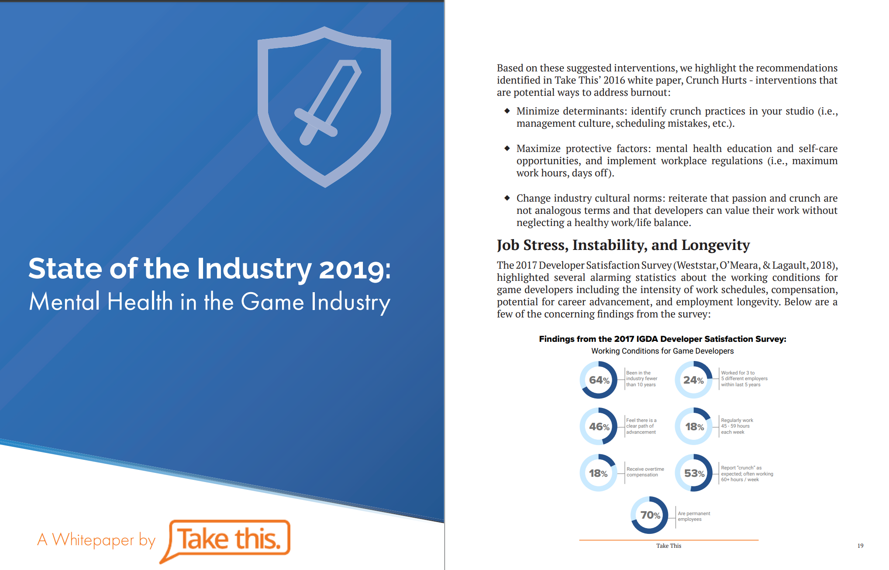

# Conducting Literature Reviews {.unnumbered}

## What are Research Papers and Academic Books? {.unnumbered}

Academic journals and books are primary resources in the realm of scholarly research. They are fundamental in disseminating and validating new knowledge through rigorous standards. Understanding their roles and characteristics is crucial for students and researchers alike.

### Academic Journals: Cornerstones of Scholarly Communication {.unnumbered}

- **Peer-Reviewed Research Papers**: Academic journals predominantly feature peer-reviewed research papers. These papers are evaluated by experts in the field before publication, ensuring the research's credibility, accuracy, and contribution to the field.

- **Specialization and Focus**: Journals often specialize in specific academic disciplines or sub-disciplines, providing focused and in-depth coverage of particular subjects.

- **Publication Frequency**: They are usually published periodically (e.g., monthly, quarterly), ensuring a continuous flow of current research.

- **Accessibility**: Many journals are accessible through academic libraries or digital platforms, offering extensive databases for research purposes.

### Academic Books: In-Depth Scholarly Exploration {.unnumbered}

- **Comprehensive Coverage**: Academic books offer extensive and detailed exploration of a particular topic, often providing broader context and deeper analysis than journal articles.

- **Types of Academic Books**: These include textbooks, which are educational resources for students; monographs, which focus on a single topic or field of study; and edited volumes, which compile chapters written by different experts in the field.

- **Peer Review and Editorial Process**: Similar to journal articles, academic books often undergo a peer-review process. However, the process may be longer, and the evaluation often includes the book's overall structure, argumentation, and contribution to existing literature.

- **Publishing Houses**: Reputable academic publishing houses are known for their rigorous standards and contribute to the book's credibility.

### Evaluating Credible Academic Sources {.unnumbered}

- **Authority and Expertise**: Check the credentials and academic background of authors and editors. Experienced and well-regarded scholars are more likely to produce reliable content.

- **Citation Metrics**: Look for how often a paper or book is cited in other scholarly works, which can indicate its impact and relevance in the field.

- **Publisher and Journal Reputation**: The reputation of the publishing house and the journal’s impact factor can be indicators of quality and reliability.

- **Currency and Relevance**: Ensure the information is current and relevant to your area of study. In rapidly evolving fields, the most recent publications are often the most reliable.

Understanding the nature and value of academic journals and books is crucial for engaging with scholarly content. They provide a foundation for academic inquiry, ensuring the integrity and advancement of research across disciplines.

## How to Find Research Papers  {.unnumbered}

There are many ways to find research papers, both paid and free. Here are a few popular methods:

### Use a specialized search engine. {.unnumbered}

Specialized search engines are designed to search for specific types of information, such as research articles. Here are some tips on how to use a specialized search engine to find research articles:

**Choose the right search engine.** There are many specialized search engines available, so it is important to choose one that is relevant to your topic. Some popular specialized search engines for research articles include:

-   Google Scholar

-   PubMed

-   Web of Science

-   Scopus

-   IEEE Xplore

-   ACM Digital Library

**Use keywords.** When you are searching for research articles, it is important to use keywords that are relevant to your topic. You can use the same keywords that you would use for a general search engine, but you may also need to use more specific keywords.

**Use advanced search features.** Most specialized search engines have advanced search features that allow you to narrow down your search results. For example, you can specify the publication date, the language, or the type of document.

**Read the results carefully.** Once you have found some research articles, take some time to read them carefully. This will help you identify the articles that are most relevant to your research.

**Evaluate the quality of the sources.** Not all sources are created equal. When you are evaluating the quality of a research article, consider the following factors:

-   The author's credentials

-   The publication date

-   The journal's reputation

-   The methodology used

-   The findings of the study

By following these tips, you can use a specialized search engine to find research articles that are relevant to your topic and of high quality.

Here are some additional tips for using a specialized search engine to find research articles:

**Use quotation marks to search for exact phrases.** For example, if you are looking for articles about the "impact of social media on mental health," you would search for "impact of social media on mental health."

**Use Boolean operators to combine keywords.** Boolean operators, such as AND, OR, and NOT, can be used to combine keywords and narrow down your search results. For example, if you are looking for articles about the "impact of social media on mental health" in the journal "Nature," you would search for "impact of social media AND mental health AND Nature."

**Use filters to narrow down your results.** Most specialized search engines allow you to filter your results by publication date, language, and other criteria. This can be helpful if you are looking for specific types of research articles.

**Use the search engine's help documentation.** Most specialized search engines have help documentation that can provide you with more information about how to use the search engine.

I hope these tips help you find the research articles you are looking for.

### Check your university library. {.unnumbered}

Your university library has a wealth of resources that you can use to find research articles. Here are some tips on how to use your university library to find research articles:

**Talk to a librarian.** Librarians are experts in finding information. They can help you choose the right databases and search strategies for your research.

**Use the library's online catalog.** The library's online catalog is a searchable database of all the books, journals, and other materials that the library owns.

**Use the library's databases.** The library subscribes to a variety of databases that contain research articles. These databases can be searched by keyword, author, or subject.

**Ask for help from a research assistant.** Many libraries have research assistants who can help you find research articles.

### Search for preprints. {.unnumbered}

A research preprint is a preliminary version of a research paper that is made available online before it has been peer-reviewed and published in a journal. Preprints are often used by researchers to share their work with the wider community and to get feedback on their findings.

Preprints can be a valuable resource for researchers, as they can provide access to the latest research findings before they are published. They can also help researchers to get feedback on their work and to collaborate with other researchers.

However, it is important to keep in mind that preprints have not been peer-reviewed and may contain errors. Therefore, it is important to evaluate the quality of the preprint carefully before citing it in your own research.

Here are some of the advantages of using preprints:

**Faster dissemination of research findings.** Preprints can be made available online much faster than traditional journal articles, which can take months or even years to publish. This allows researchers to share their work with the wider community more quickly and to get feedback on their findings.

**Increased collaboration.** Preprints can be a valuable tool for collaboration, as they allow researchers to share their work with other researchers before it has been published. This can help to identify potential errors and to improve the quality of the research.

**Reduced publication bias.** Preprints can help to reduce publication bias, which is the tendency for journals to publish research that supports the authors' hypothesis. This is because preprints are not subject to the same peer-review process as journal articles, and therefore, they are more likely to be published regardless of the findings.

Here are some of the disadvantages of using preprints:

**Unreviewed research.** Preprints have not been peer-reviewed, which means that they may contain errors. Therefore, it is important to evaluate the quality of the preprint carefully before citing it in your own research.

**Potential for plagiarism.** Preprints are publicly available, which means that there is a potential for plagiarism. Therefore, it is important to give credit to the original authors of the research when you cite a preprint.

**Legal issues.** There are a number of legal issues that can arise with the use of preprints. For example, it is important to make sure that you have the right to share the preprint and that you are not violating the authors' copyright.

**Search preprint repositories.** There are a number of preprint repositories that you can search, such as:

-   arXiv

-   bioRxiv

-   medRxiv

-   PeerJ Preprints

-   PsyArXiv

-   SocArXiv

**Use specialized search engines.** There are also a number of specialized search engines that can be used to find preprints, such as:

-   Preprints.org

-   ASAPbio

-   PreLights

-   Publons

When using preprints, it is important to keep in mind that they have not been peer-reviewed and may contain errors. Therefore, it is important to evaluate the quality of the preprint carefully before citing it in your own research.

Here are some things to consider when evaluating a preprint:

-   The author's credentials

-   The methodology used

-   The findings of the study

-   The potential for bias

### Use social media. {.unnumbered}

You can use social media to find research articles in a few different ways:

**Follow researchers and research institutions.** Many researchers and research institutions use social media to share their work, including research articles. By following these accounts, you can stay up-to-date on the latest research in your field.

**Use relevant hashtags.** Hashtags are a great way to find research articles on social media. When you search for a relevant hashtag, you will see all the posts that have been tagged with that hashtag. This can be a great way to find research articles that you might not have otherwise found.

**Join research groups and communities.** There are many research groups and communities on social media where researchers can share their work and discuss research topics. By joining these groups, you can connect with other researchers and find research articles that are relevant to your interests.

**Attend online conferences and workshops.** Many conferences and workshops are now being held online, and these can be a great way to find research articles. Often, the presentations from these events are posted online, and you can also interact with the speakers and other attendees.

Here are some specific social media platforms that you can use to find research articles:

**Twitter:** Twitter is a great platform for following researchers and research institutions. You can also use Twitter to search for research articles using hashtags.

**LinkedIn:** LinkedIn is a professional networking platform that can be a great way to connect with researchers and find research articles.

**ResearchGate:** ResearchGate is a social networking platform for researchers. You can use ResearchGate to find research articles, collaborate with other researchers, and get feedback on your own work.

**Academia.edu:** Academia.edu is a social networking platform for academics. You can use Academia.edu to find research articles, connect with other academics, and share your own work.

**Facebook:** Facebook can also be a good platform for finding research articles, especially if you are part of a research group or community.

When using social media to find research articles, it is important to be critical of the sources you find. Not all research articles that are shared on social media are of high quality. It is important to evaluate the quality of the article before you cite it in your own research. If you are unsure about the quality of a research article, it is always best to consult with a librarian or another expert.

### Contact experts in your field. {.unnumbered}

There are a few ways to use experts in your field to find research articles:

**Talk to your professors or advisors.** Your professors and advisors are likely to be familiar with the latest research in your field. They can recommend research articles that you should read and can also help you to identify experts in your field.

**Attend conferences and workshops.** Attending conferences and workshops is a great way to meet experts in your field and to learn about the latest research. You can also ask experts for recommendations for research articles.

**Read research blogs and newsletters.** There are many research blogs and newsletters that are written by experts in various fields. These can be a great way to stay up-to-date on the latest research and to find research articles that are relevant to your interests.

**Use social media.** As mentioned earlier, you can use social media to connect with experts in your field and to find research articles. You can follow researchers and research institutions on Twitter, LinkedIn, and other social media platforms. You can also join research groups and communities on social media.

Here are some specific things you can do to find experts in your field:

**Search for experts by name or by topic.** There are many online directories that list experts in various fields. You can search for experts by name or by topic.

**Look for experts who have published research articles in your field.** You can use a specialized search engine, such as Google Scholar, to find research articles that have been published in your field. The authors of these articles are likely to be experts in your field.

**Look for experts who have given presentations at conferences or workshops in your field.** You can find information about conferences and workshops on the websites of professional organizations.

**Look for experts who are active on social media.** As mentioned earlier, you can use social media to connect with experts in your field. You can follow researchers and research institutions on Twitter, LinkedIn, and other social media platforms. You can also join research groups and communities on social media.

When using experts in your field to find research articles, it is important to be respectful of their time. When you reach out to an expert, be sure to explain why you are interested in their research and what you are looking for. Be sure to also thank the expert for their time and consideration.

### Utilizing AI Tools for Research Article Discovery {.unnumbered}

AI tools, such as custom ChatGPT models and platforms like Elicit, are transforming the way researchers find and analyze academic papers. These advanced technologies offer unique features for conducting literature reviews.

Using Custom ChatGPT Models

Custom ChatGPT models, adapted from OpenAI's GPT architecture, are tailored for specific research needs. Here's how to leverage them:

- **Select a suitable ChatGPT variant.** Depending on your research area, choose a ChatGPT model that has been trained or fine-tuned in that domain.

- **Input precise queries.** Use detailed and clear questions to guide the AI in fetching relevant research papers.

- **Review generated summaries.** Custom ChatGPT models can provide summaries of research articles, saving time in initial screening.

- **Check for latest updates.** Ensure the model is up-to-date with the latest research to get the most current results.

Leveraging Platforms like Elicit

Elicit, an AI-driven research assistant, offers a streamlined approach to finding research papers:

- **Pose specific research questions.** Elicit uses AI algorithms to understand and respond to complex research queries.

- **Explore AI-curated lists.** Elicit categorizes papers based on methodologies, results, and relevance, making it easier to find pertinent studies.

- **Use real-time analysis.** The platform can highlight emerging trends and research gaps in your field.

Best Practices for Using AI Tools

- **Combine with traditional methods.** Use AI tools as a complement to traditional research methods for a comprehensive literature review.

- **Evaluate AI-sourced papers.** Assess the credibility and relevance of the papers these tools recommend.

- **Stay updated with tool capabilities.** As AI tools evolve, keep abreast of new features and updates that could enhance your research process.

In summary, custom ChatGPT models and platforms like Elicit are powerful aids in the literature review process, offering efficient and targeted ways to find research articles. However, it's important to use them judiciously and in conjunction with traditional research methods for the best results.

## How to Read Research Papers {.unnumbered}

There are many different approaches to reading a research paper, but these are some of the most effective ones.

### The three-pass approach. {.unnumbered}

The three-pass approach to reading a research paper is a method of reading a paper in three stages, each with a specific goal.

**The first pass**. This is a quick scan to capture a high-level view of the paper. You should read the title, abstract, and introduction carefully, and then skim the rest of the paper, paying attention to the headings and subheadings. The goal of this pass is to get a general understanding of what the paper is about, its main points, and its contributions to the field.

**The second pass**: This is a more detailed reading of the paper. You should read the introduction and conclusion carefully, and then read the rest of the paper in more detail, paying attention to the methods, results, and discussion. The goal of this pass is to understand the paper's arguments and evidence, and to assess its strengths and weaknesses.

**The third pass**: This is a critical reading of the paper. You should read the paper carefully, taking notes and challenging the author's assumptions and conclusions. The goal of this pass is to fully understand the paper and to be able to critically evaluate its claims.

### The question-based approach. {.unnumbered}

The question-based approach to reading a research paper is a method of reading a paper by asking questions about the paper as you read. This approach can help you to focus your reading and to ensure that you understand the key points of the paper.

Here are some questions that you can ask yourself as you read a research paper:

-   What is the purpose of the paper?

-   What are the main questions that the paper addresses?

-   What are the key findings of the paper?

-   How does the paper contribute to the existing body of knowledge?

-   What are the strengths and weaknesses of the paper?

-   How does the paper relate to my own research interests?

You can also ask more specific questions that are relevant to the specific paper that you are reading. For example, if you are reading a paper about a new medical treatment, you might ask questions about the safety and effectiveness of the treatment.

The question-based approach can be used in conjunction with the three-pass approach to reading a research paper. In the first pass, you can ask general questions about the paper to get a sense of what it is about. In the second pass, you can ask more specific questions to understand the paper in more detail. In the third pass, you can critically evaluate the paper by asking questions about its methods, findings, and conclusions.

The question-based approach is a flexible method that can be adapted to your own needs and preferences. By asking questions as you read, you can improve your understanding of research papers and your ability to critically evaluate their claims. The question-based approach is a valuable tool for reading and understanding research papers. By asking questions as you read, you can improve your comprehension and critical thinking skills.

### The active reading approach. {.unnumbered}

Active reading is a method of reading that involves engaging with the text in a thoughtful and critical way. It is different from passive reading, which is simply reading the text without thinking about it.

Active reading can be used to read any type of text, but it is especially important for reading research papers. Research papers are often dense and technical, so it is important to be actively engaged in order to understand them.

Here are some tips for active reading:

**Ask questions**: As you read, ask yourself questions about the text. What is the author's purpose? What are the main points? What evidence does the author provide to support their claims?

**Take notes**: Taking notes can help you to remember the key points of the text and to track your progress. You can take notes in the margins of the text, or you can use a separate notebook.

**Summarize**: After each section of the text, summarize the key points in your own words. This will help you to solidify your understanding of the text.

**Discuss the text with others**: Talking to others about a text can help you to gain new insights and perspectives.

**Annotate the text**: Annotating the text means making notes and comments in the margins. This can help you to highlight important passages, ask questions, and make connections between different parts of the text.

**Use a highlighter**: Highlighting important passages can help you to focus your attention and to remember the key points of the text.

**Take a break**: Don't try to read a research paper in one sitting. Take breaks to refresh your mind and to come back to the text with fresh eyes.

Active reading takes time and effort, but it is a valuable skill for anyone who wants to learn and grow. By actively reading research papers, you can improve your comprehension, critical thinking skills, and ability to learn new things.

### The collaborative reading approach. {.unnumbered}

This approach involves reading the paper with a partner or group of people. This can be helpful for getting different perspectives on the paper and for identifying areas where you need clarification.

No matter which approach you choose, it is important to take your time and read the paper carefully. Research papers can be dense and challenging, but they can also be very rewarding. By taking the time to read them carefully, you can learn a lot about your field and contribute to the advancement of knowledge. The question-based approach is a valuable tool for reading and understanding research papers. By asking questions as you read, you can improve your comprehension and critical thinking skills.

### Leveraging AI for Article Analysis {.unnumbered}

Utilizing AI in research article analysis is akin to enhancing the active reading approach. This method involves engaging AI tools to assist in comprehending and synthesizing complex academic texts. It's a shift from traditional reading practices, integrating technology to deepen understanding and efficiency.

AI-Assisted Reading Strategies

**Query-Based Summarization**: AI tools can generate concise summaries of research papers. Pose specific questions or topics to the AI, and it will extract key points, significantly aiding in understanding the essence of the paper.

**Automated Note-Taking**: AI can automatically take notes on key aspects like hypotheses, methodologies, results, and conclusions. This feature aids in retaining important information and organizing thoughts effectively.

**Customized Annotations**: Use AI to annotate documents. AI can highlight significant sections, categorize information, and even add context-specific notes, making it easier to navigate through complex research.

**Semantic Analysis**: AI algorithms can analyze the text semantically, providing insights into the author's purpose, argument structure, and evidence used. This deeper level of analysis enhances comprehension.

**Interactive Discussion Platforms**: Engage with AI-driven discussion platforms where summaries and key points can be discussed with peers or AI itself, providing a broader perspective on the research.

**Contextual Highlighting**: AI can highlight passages not just based on keywords but also based on the context and relevance to your research query, ensuring focused attention on the most pertinent sections.

**Scheduled Breaks with AI Reminders**: AI tools can remind you to take breaks, helping to maintain optimal focus and prevent information overload.

Best Practices for Using AI

- **Combine AI with Manual Efforts**: While AI significantly aids in understanding and analyzing research papers, complementing it with manual reading and critical thinking ensures a more thorough comprehension.

- **Customize AI Tools**: Tailor AI settings to suit your specific research needs, whether it's focusing on certain types of methodologies or extracting data from particular sections of papers.

- **Regularly Update AI Parameters**: As your research evolves, update the AI’s parameters to align with changing focus areas or new research questions.

- **Critically Evaluate AI Summaries**: Cross-check AI-generated summaries and notes against the original text to ensure accuracy and completeness.

Using AI for reading and analyzing research articles transforms the active reading approach into a more efficient and comprehensive process. It enhances understanding, saves time, and provides deeper insights, making it an invaluable tool in the modern research landscape.

## How to Write Research Papers {.unnumbered}

There are many different approaches to writing a research paper, but some of the most effective ones include:

### Choose an interesting topic you know. {.unnumbered}

This is the most important factor, as you will be spending a lot of time researching and writing about your topic. If you are not interested in the topic, it will be difficult to stay motivated. You should also make sure your topic is relevant to your field of study or to your career goals. This will make it easier to find sources and to write a research paper that is valuable to others. Don't choose a topic that is too broad or too narrow. A good research topic should be specific enough to be manageable, but broad enough to allow for some exploration. I also recommend that you choose a topic that has been studied before. This will make it easier to find sources and to get started on your research. However, you can also choose a topic that is new or emerging, as long as you are prepared to do the necessary research. If you find it difficult finding a topic, you can talk to an expert, such as a professor or independent researcher. They can help you choose a research topic that is appropriate for your level of study and that meets the requirements of your assignment.

One approach you can take is brainstorming a list of potential topics. Write down any topics that you are interested in or that you think would be interesting to research. You may also need to do some preliminary research. Once you have a list of potential topics, do some preliminary research to see how much information is available. You can use online databases, library catalogs, and search engines to find relevant sources. If you already chose a topic but you are having a hard time making progress, do not be afraid to change your topic. It is perfectly normal to change your research topic as you learn more about the subject. If you find that your original topic is not as interesting or manageable as you thought, don't be afraid to change it. For this purpose, I recommend starting your project early enough to make a change. You should also know that you do not need to make a full topic change. A minor change may suffice.

### Do your research thoroughly. {.unnumbered}

Read as many relevant research papers as you can and take good notes. This will help you to develop a strong understanding of the topic and to form your own arguments. It will help if you use a variety of sources. Don't rely on just one or two sources. Look for information from a variety of sources, including books, articles, websites, and interviews. When choosing between different sources, evaluate your sources critically. Not all sources are created equal. Be sure to evaluate the quality of your sources before you use them. Consider the author's credentials, the purpose of the source, and the date of publication. While you are collecting and verifying these sources, take notes carefully.

As you gather information, be sure to take careful notes. This will help you keep track of your sources and the information you have found. All the collected information must be synthesized. Once you have gathered a lot of information, it's time to synthesize it. This means putting the information together to form a coherent argument. This stage of the research is not always easy. I recommend that you be patient. It takes time to do thorough research. Don't expect to find all the answers overnight. It is also necessary to be persistent. Don't give up if you don't find the information you're looking for right away. Keep searching until you find what you need.

### Write a clear and concise thesis statement. {.unnumbered}

A thesis statement is a sentence that summarizes the main point of your essay. It should be clear, concise, and arguable. You must first start with a strong research question. What do you want to learn about? What are you trying to prove or disprove? Next, narrow down your focus. Don't try to cover too much ground in your essay. Focus on one specific aspect of your research question. Once you have narrowed down your focus, further refine it so that you can state your main point clearly. What is the one thing you want your readers to take away from your essay?

Your newly created thesis statement must be arguable. Your thesis statement should be a claim that can be supported with evidence from your research. Finally, it must be concise. Your thesis statement should be one or two sentences long.

Here is an example of a clear and concise thesis statement:

-   The rise of social media has led to an increase in cyberbullying among teenagers.

This thesis statement is clear because it states the main point of the essay in a concise and direct way. It is also arguable because it is a claim that can be supported with evidence from research.

Here is an example of a thesis statement that is not clear:

-   Social media has had a big impact on teenagers.

This thesis statement is not clear because it does not state the main point of the essay in a specific way. It also does not make a claim that can be supported with evidence.

Here is an example of a thesis statement that is not concise:

-   The rise of social media has had a profound impact on the lives of teenagers, both positive and negative. It has led to an increase in communication and social interaction, but it has also led to an increase in cyberbullying and other forms of online harassment.

This thesis statement is not concise because it is too long and wordy. It could be improved by making it more specific and by narrowing down the focus.

### Write strong research hypotheses or questions. {.unnumbered}

Research hypotheses and research questions are fundamental components of media and communication research. They help guide the research process and shape the focus of a study. Here's a breakdown of what research hypotheses and questions are in the context of media and communication research:

**Research Hypotheses**

A research hypothesis is a clear and testable statement that predicts the relationship between two or more variables or concepts. It serves as a tentative answer to a research question and is usually based on existing theory or prior research.

**Characteristics**

**Testability**: Hypotheses must be specific and precise enough to be empirically tested through data collection and analysis.

**Directional or Non-Directional**: Hypotheses can be directional (predicting the direction of an effect, e.g., "increased exposure to violent media content will lead to higher levels of aggression") or non-directional (simply predicting the existence of an effect, e.g., "there is a relationship between media violence and aggression").

**Examples**

-   "H1: Increased social media use is positively associated with feelings of loneliness among young adults."

-   "H2: News framing significantly influences public perception of climate change."

**Purpose**: Research hypotheses help researchers make specific predictions about the outcomes of their study and guide the selection of research methods and data analysis techniques.

**Research Questions**

**Definition**: Research questions are inquiries that researchers pose to explore and understand a specific aspect of media and communication. They are often broader and more exploratory than hypotheses and are used to frame the overall research inquiry.

**Characteristics**

**Open-Ended**: Research questions are typically open-ended and do not presuppose a specific answer. They allow for exploration and discovery.

**Descriptive or Analytical**: Research questions can be descriptive (seeking to describe a phenomenon) or analytical (aiming to understand the relationships between variables or concepts).

**Examples**

-   "What is the impact of social media on political engagement among young adults?"

-   "How do media portrayals of gender influence audience perceptions of gender roles?"

**Purpose**: Research questions serve as the overarching themes of a study, guiding the overall research process, literature review, data collection, and analysis. They help researchers identify what they want to investigate and explore.

In media and communication research, hypotheses and research questions often work together. Research questions provide the broader context and exploration, while hypotheses offer specific, testable propositions within that context. Researchers may start with research questions to gain a comprehensive understanding of a topic and then formulate hypotheses to test specific aspects or relationships they identify during the exploration phase.

Both research hypotheses and questions play crucial roles in designing and conducting meaningful research in media and communication, helping researchers advance knowledge and contribute to the field's theoretical and practical understanding.

### Organize your paper carefully. {.unnumbered}

Organizing your paper carefully is essential for writing a clear and concise paper that is easy to read and understand. The best place to start is with an outline. An outline will help you organize your thoughts and ideas before you start writing. It will also help you make sure that your paper has a logical flow. You should use headings and subheadings in your outline that can be easily transferred to your full paper. Headings and subheadings will help your readers quickly scan your paper and find the information they are looking for. When fleshing out your outline, you should use transition words and phrases. Transition words and phrases will help your readers follow your train of thought and make sure that your paper flows smoothly. Before you submit your paper, proofread it carefully. Before you submit your paper, proofread it carefully for any errors in grammar, spelling, or punctuation.

If you have a thesis statement already, but are having a hard time starting with your outline or writing, you can start by brainstorming your main points. What are the main points you want to make in your paper? Once you have a list of your main points, you can start to organize them into an outline. Your main points should then be presented in a logical order. When you are organizing your paper, it is important to use a logical order. This means that your main points should flow from one to the next in a logical way. It is not uncommon to revise your outline during that stage, so do not be afraid to revise your outline. As you write your paper, you may need to revise your outline. This is perfectly normal. The outline is just a tool to help you organize your thoughts, and it is not set in stone. At any stage, you can get feedback from others. Once you have a draft of your paper, get feedback from others. This could be your professor, a tutor, or a friend. Feedback from others can help you identify any areas where your paper can be improved. If you are afraid of other people reading your full paper, you can give them pieces of the paper, an early draft, or an outline. By giving them a small, rough portion of the paper, it can make it easier to handle suggestions since you know it is not yet meant to be perfect.

### Write in a clear and concise style. {.unnumbered}

Writing in a clear and concise style is paramount for a research paper, as it ensures that complex ideas are communicated effectively to the readers. To achieve this, several key strategies should be employed. First, focus on crafting well-structured sentences that convey one main idea each. Avoid excessive use of jargon and technical terms, opting instead for plain language that is easily understandable. Additionally, make use of active voice to enhance readability and directness in your writing.

Paragraphs should be organized logically, starting with a clear topic sentence that introduces the main point of the paragraph. Follow this with supporting sentences that provide evidence, examples, or explanations related to the topic. Ensure a smooth flow by using transitional words and phrases to connect ideas between sentences and paragraphs.

In terms of length, aim for paragraphs that are neither too short nor too long. A paragraph ideally consists of 3-5 sentences, but this can vary depending on the complexity of the topic and the depth of discussion required.

Lastly, edit and revise your writing diligently. Remove any redundant or repetitive information, eliminate unnecessary adjectives or adverbs, and tighten your sentences. Use concise language to express your ideas without sacrificing clarity. By following these guidelines, you can produce a research paper that is both easily comprehensible and intellectually rigorous.

### Use evidence to support your arguments. {.unnumbered}

Using evidence effectively to support your arguments is crucial for building a strong and convincing case. Start by clearly stating your argument or thesis in a topic sentence at the beginning of the paragraph. This sets the stage for what you will be discussing.

Next, introduce your evidence in a way that demonstrates its relevance to your argument. This could involve citing credible sources such as academic studies, statistics, expert opinions, or real-world examples. Make sure the evidence is directly related to the point you're trying to make and supports the overall message of your paper.

After introducing the evidence, provide context or explanation to help your readers understand how the evidence supports your argument. Avoid assuming that the significance of the evidence is immediately clear; instead, guide your readers through the connection between the evidence and your argument. This might involve explaining the methodology behind a study, interpreting statistics, or describing the circumstances of a specific example.

Once you've presented the evidence and its context, analyze it in relation to your argument. Explain why the evidence is relevant and how it reinforces your thesis. Discuss any patterns, trends, or insights that emerge from the evidence. This is the heart of your paragraph, where you demonstrate the logical connection between the evidence and your argument.

Conclude the paragraph by summarizing the main points you've made and reiterating how the evidence supports your overall argument. This helps reinforce the reader's understanding of the relationship between the evidence and your thesis.

Remember to maintain a balance between the amount of evidence and the amount of analysis. Too much evidence without analysis can make your writing feel disjointed, while too much analysis without evidence can weaken your argument's credibility. By following this structure, you can effectively integrate evidence to bolster your arguments and enhance the persuasiveness of your research paper.

### Proofread your paper carefully. {.unnumbered}

Proofreading is an extremely important step in ensuring the quality and accuracy of your research paper. To effectively proofread your work, consider the following tips. Begin by taking a break after completing the initial draft; distancing yourself from the content will allow you to approach the paper with fresh eyes. When you're ready to proofread, start by checking for grammatical errors, including punctuation and spelling mistakes. Carefully review each sentence to ensure proper subject-verb agreement, consistent verb tenses, and accurate word choices.

Pay special attention to sentence structure and clarity. Long, convoluted sentences can confuse readers, so consider breaking them into smaller, more digestible ones. Read your paper aloud to identify awkward phrasing or unclear passages; if it doesn't sound right when spoken, it might need revision.

Check your formatting to ensure consistency throughout the paper. Verify that headings, font styles, spacing, and citations adhere to the required style guide (e.g., APA, MLA).

Focus on the flow of your argument. Ensure that each paragraph logically connects to the next, and that your ideas progress in a coherent manner. Check that your transitions are smooth, guiding the reader through your paper seamlessly.

Review your in-text citations and reference list to confirm that all sources are properly credited and formatted correctly. Mistakes in citations can harm your paper's credibility.

Consider seeking feedback from peers or mentors. A fresh perspective can reveal issues you might have missed. Proofreading tools like grammar checkers can also be helpful, but use them judiciously, as they may not catch every mistake.

Finally, read your paper multiple times, focusing on one aspect (e.g., grammar, clarity, citations) during each read-through. This targeted approach can help you catch different types of errors.

Ultimately, thorough proofreading ensures that your research paper is polished, clear, and effectively communicates your ideas to your readers.

### Additional Tips {.unnumbered}

Here are some additional tips for writing a research paper:

**Start early.** Don't wait until the last minute to start writing your paper. This will give you enough time to do your research thoroughly and to write a well-organized paper.

**Get feedback from others.** Ask a friend, family member, or professor to read your paper and give you feedback. This can help you to identify areas where your paper can be improved.

**Don't be afraid to revise.** It is important to revise your paper multiple times before you submit it. This will help you to improve your writing style and to make sure that your paper is error-free.

**Take breaks.** Don't try to write your paper in one sitting. Take breaks to clear your head and to come back to it with fresh eyes.

### Academic Examples {.unnumbered}

There are many different ways to report research in academia. Some of the most common methods include:

**Research papers**: Research papers are the most common way to report research in academia. They are typically published in academic journals and are written in a formal style.

**Conference papers**: Conference papers are presented at academic conferences. They are typically shorter than research papers and are written in a more informal style.

{width="100%"}

**Theses and dissertations**: Theses and dissertations are written by graduate students to complete their degree requirements. They are typically longer and more comprehensive than research papers.

**Books**: Books are another way to report research. They are typically written by experts in a particular field and can be a good way to communicate research to a wider audience.

**Reports**: Reports are written for a specific audience, such as a government agency or a business. They are typically shorter than research papers and focus on a specific topic.

**Presentations**: Presentations are a way to share research with a live audience. They can be given at conferences, workshops, or other events.

{width="100%"}

**Blogs and social media**: Blogs and social media can be used to share research with a wider audience. They are a good way to communicate research in a more informal way.

The best way to report research depends on the specific research project and the intended audience. However, all of these methods can be effective ways to communicate research findings and to contribute to the academic community.

### Industry Examples {.unnumbered}

There are many different ways to report research in industry. Some of the most common methods include:

**White papers**: White papers are a type of report that is commonly used in industry to present research findings to a specific audience. They are typically written in a clear and concise style and focus on a specific topic.

{width="100%"}

**Executive summaries**: Executive summaries are a brief overview of a white paper or other research report. They are typically written for senior executives and other decision-makers.

**Presentations**: Presentations are a way to share research findings with a live audience. They can be given at company meetings, conferences, or other events.

**Blogs and social media**: Blogs and social media can be used to share research findings with a wider audience. They are a good way to communicate research in a more informal way.

**Press releases**: Press releases are a way to share research findings with the media. They are typically written in a clear and concise style and focus on the key findings of the research.

**Technical reports**: Technical reports are a detailed document that describes the research methods and findings. They are typically written for a technical audience.

The best way to report research in industry depends on the specific research project and the intended audience. However, all of these methods can be effective ways to communicate research findings and to contribute to the industry community.

### Sections of an Academic Paper {.unnumbered}

**Title:** The title should be clear, concise, and informative. It should accurately reflect the main topic of the paper and be interesting enough to grab the reader's attention. When titling a paper, it should be no more than 12 words. You only capitalize the first words and proper nouns. If you include a semi-colon, the first word after the semi-colon is considered a first word. You should also bold, center, and double-space the title.

**Abstract:** The abstract should be concise and informative, summarizing the main points of the paper in a way that is easy to understand. It should be written in the past tense and should not include any citations. The abstract should be a concise and informative summary of the paper, typically 150-250 words long. It should state the purpose of the study, the methods used, the main findings, and the conclusions.

**Introduction:** The introduction should provide background information on the topic, define the research problem, and state the research question or hypothesis. It should also provide a brief overview of the paper's organization. You should also include an overview of the structure of your paper, including key findings.

**Literature review:** The literature review should discuss the relevant research that has been done on the topic. It should identify the gaps in the literature and explain how the current study will contribute to knowledge. The literature review should be objective and should not include any personal opinions or biases.

**Methods:** The methods section should describe how the research was conducted. It should include information on the participants, the materials and procedures used, and the data analysis methods. The methods section should be clear and concise, and should be written in the past tense.

**Results:** The results section should present the findings of the study. It should be organized and easy to follow, and should use tables and figures to illustrate the data. The results section should be objective and should not include any interpretations or conclusions.

**Discussion:** The discussion section should interpret the results of the study and relate them to the literature. It should also discuss the limitations of the study and suggest directions for future research. The discussion section should be thoughtful and insightful, and should be written in the present tense.

**References:** The references section should list all of the sources that were cited in the paper. It should be formatted according to the style guide that is being used (e.g., APA, MLA, Chicago).

## How to Cite Research {.unnumbered}

Proper citation of research articles varies depending on the medium, such as newspaper articles, online blogs, or social media posts. Understanding these nuances ensures accurate attribution and enhances the credibility of your work.

### In Newspaper Articles {.unnumbered}

- **Within the Text**: Incorporate the researcher's name and the study's key findings within the body of the article. Example: "According to a study led by Dr. Jane Smith, solar energy efficiency has improved by 40%."

- **End of Article**: At the conclusion of the article, provide a full citation. This could include the study's title, journal name, and publication year. Example: "For more details, see 'Advancements in Solar Cell Technology' in the Journal of Renewable Energy, 2023."

### In Online Articles/Blogs {.unnumbered}

- **Hyperlinks**: Directly link to the research article when mentioning it. Example: "Recent research [hyperlinked] demonstrates a significant increase in solar energy efficiency."

- **Brief Citation in Text**: If hyperlinks are not feasible, include a brief citation within the text. Example: "A 2023 study in the Journal of Renewable Energy indicates significant improvements in solar energy technology."

- **Reference List**: At the end of the blog post, provide a detailed reference list with full citations of all sources.

### In Social Media Posts {.unnumbered}

- **Condensed Citation**: Due to character limits, use a shortened form of citation. Include the researcher's name and year of publication. Example: "Dr. Jane Smith's 2023 study shows remarkable progress in solar technology."

- **Link to the Study**: Where possible, include a link to the research article. On platforms like Twitter, this may involve a link in a follow-up comment or in a thread.

- **Using Hashtags**: Employ relevant hashtags for the study or journal for increased visibility and searchability.

### In News Broadcasts {.unnumbered}

- **Verbal Citation**: When referencing a study, mention the lead researcher and the journal name. Example: "In a recent study published in the Journal of Renewable Energy, Dr. Jane Smith and her team discovered..."

- **Visual Citation**: If the study is shown on-screen, display a text citation with the study title, journal, and publication year.

### General Considerations {.unnumbered}

- **Citation Styles**: Depending on the medium and audience, the citation style can vary. For academic or professional audiences, more formal citation styles like APA or MLA may be appropriate.

- **Attribution Ethics**: Regardless of the medium, ensure that the original research is accurately and fairly represented, and that the authors' work is properly credited.

- **Contextual Accuracy**: Always cite in a manner that preserves the integrity and context of the original research, avoiding misrepresentation of the study's findings.

By tailoring your citation approach to the specific media format, you ensure proper acknowledgment of academic research while adhering to the varying conventions and limitations of each medium.
