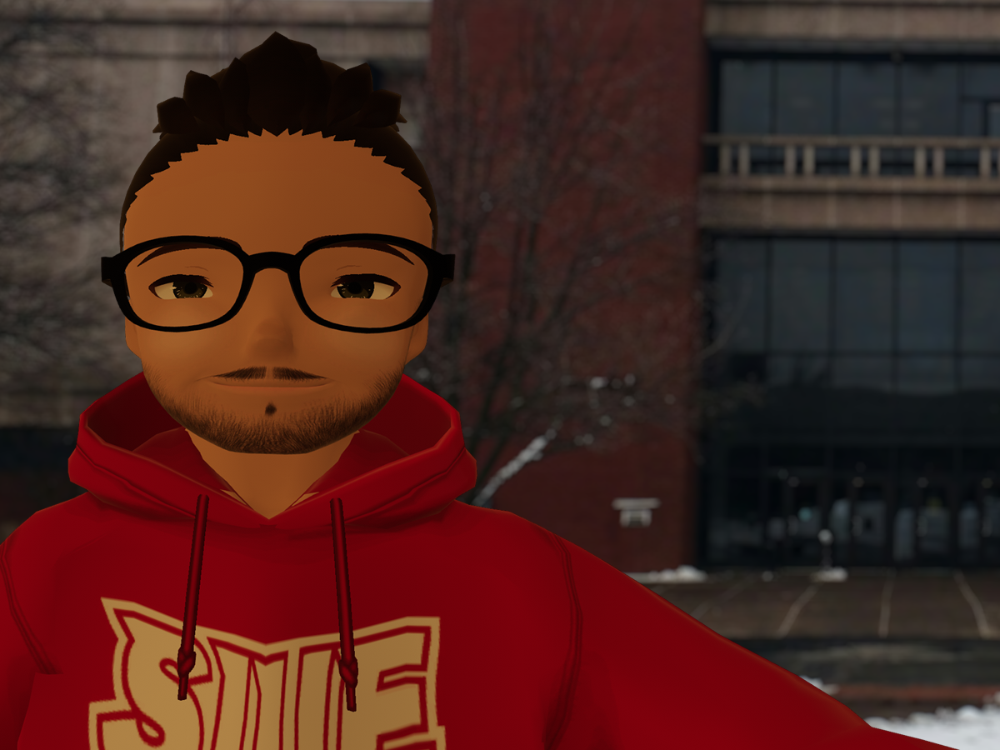

# Preface {.unnumbered}

Welcome to "Quantitative Research in Mass Communications: R and RStudio," a comprehensive guide designed to navigate the intricate pathways of quantitative research in the ever-evolving field of mass communications. This textbook is a culmination of my journey in academia and a reflection of my commitment to advancing the understanding of mass communication research methods, particularly through the lens of quantitative analysis using R and RStudio.

{width="100%"}

I am Dr. Alex P. Leith, currently serving as an Assistant Professor in the Department of Mass Communications at Southern Illinois University Edwardsville. My academic journey, which began with a Ph.D. in Information and Media from Michigan State University, has been a blend of rigorous research and practical application in the fields of digital media, virtual reality, and the social dimensions of digital media. My dissertation, "Gameplay Livestreaming: Agents of Gamespace," set the stage for my ongoing exploration of contemporary digital media trends.

{width="100%"}

My professional trajectory has been diverse, encompassing roles as a Graduate Assistant at Michigan State University, an Adjunct Instructor at McKendree University and St. Louis College of Pharmacy, and a Marketing Manager at Brigham Young University – Idaho. These experiences have enriched my understanding of the multifaceted nature of mass communications, both in academic and practical contexts.

This textbook is a unique endeavor, coalesced with the assistance of ChatGPT 4, a state-of-the-art language model developed by OpenAI. The collaboration with ChatGPT 4 has enabled the integration of advanced AI insights into the book's development, ensuring a blend of human expertise and technological innovation.

"Quantitative Research in Mass Communications" is structured to guide readers from the foundational aspects of mass communication research and ethics, through the complexities of IRB certification, to the development of research interests and the intricacies of conducting literature reviews. It further delves into the practicalities of formulating research questions, designing quantitative studies, and harnessing the power of R and RStudio for data management, analysis, and visualization. The book culminates with insights into engaging public audiences, writing for them, and presenting research findings effectively.

My research, reflected in publications like "Psychology of Popular Media" and "IEEE Transactions on Games," and my success in securing funding for research projects have significantly influenced the content of this textbook. The book aims not only to impart knowledge but also to inspire innovation and critical thinking in the field of mass communications.

As readers embark on this journey through "Quantitative Research in Mass Communications," my hope is that this textbook serves as a valuable resource, aiding in the development of skilled, insightful, and ethically grounded researchers in the dynamic realm of mass communications.

## Licensing {.unnumbered}

This book is published under a Creative Commons BY-SA license (CC BY-SA) version 4.0. This means that this book can be reused, remixed, retained, revised and redistributed (including commercially) as long as appropriate credit is given to the authors. If you remix, or modify the original version of this open textbook, you must redistribute all versions of this open textbook under the same license - CC BY-SA. <https://creativecommons.org/licenses/by-sa/4.0/>
